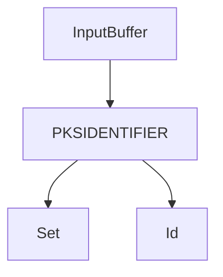

## Intro
Long-term surveillance hinges critically on microphone capture and recording capabilities, serving as a cornerstone of persistent monitoring operations, whether state-sponsored or not. Threat actors can silently harvest sensitive intelligence from team meetings, voice chats, and  internal discussions as long as the endpoint has a microphone device connected to it, providing access to organizational insights. In this blogpost, our goal is to uncover the internals behind the audio subsystem on Windows, and design a protection solution that will prompt the user whenever a process is attempting to capture microphone input, allowing them to permit or deny the access.  

## Some KS terminology 
Whenever we open our webcam, activate our microphone or enable sound. The system needs to read or write related data such as your voice or captured images into RAM. Kernel Streaming (KS) refers to the Microsoft-provided services that support kernel-mode processing of streamed data.  KS serves as a standardized interface for multimedia devices, and aims to provide low latency and simplified multimedia driver development. Microsoft provides three multimedia class driver models: port class, stream class, and AVStream. These class drivers are implemented as export drivers (kernel-mode DLLs) in the system files portcls.sys, stream.sys, and ks.sys. the ```portcls.sys``` driver is what most hardware drivers for PCI and DMA-based audio devices based on. the port clsss driver supplies a set of port drivers that implement most of the generic kernel streaming (KS) filter functionality, it's essentially another abstraction on top of ```ks.sys``` making the job of driver devs easier.

### KS pins and filters 
Conceptually, a stream undergoes processing as it flows along a data path containing some number of processing nodes. A set of related nodes is grouped together to form a KS filter, which represents a more-or-less independent block of stream-processing functionality. More complex functions can be constructed in a modular way by cascading several filters together to form a filter graph. A KS filter is implemented as a kernel-mode KS object that encapsulates some number of related stream-processing callbacks, described by a [KSFILTER_DESCRIPTOR](https://learn.microsoft.com/en-us/windows-hardware/drivers/ddi/ks/ns-ks-_ksfilter_descriptor) structure. KS filters are connected together through their pins. A pin on an audio filter can be thought of as an audio jack. A client instantiates an input or output pin on a filter when the client needs to route a data stream into or out of that filter. Similarly to a ```KSFILTER```, a ```KSPIN``` is described by a [KSPIN_DESCRIPTOR](https://learn.microsoft.com/en-us/windows-hardware/drivers/ddi/ks/ns-ks-kspin_descriptor). For example, a filter that performs audio mixing might have one [pin factory](https://learn.microsoft.com/en-us/windows-hardware/drivers/audio/pin-factories) that can instantiate a single output pin and a second pin factory that can instantiate several input pins. 

## The windows audio subsystem 
The audio architecture changed dramatically in the rewrite that was done in Vista. Technically, audio drivers do communicate through kernel streaming, but the graph typically contains only one filter. The graph is owned and operated by the Audio Engine process (Audiodg.exe) Client applications eventually get down to [WASAPI](https://learn.microsoft.com/en-us/windows/win32/coreaudio/wasapi) calls, which result in requests being sent to the Audio Engine through several layers of IPC. The Audio Engine then manages the communication with the device, not through ```IOCTL_KS_READ_STREAM``` (which is used for camera devices) but rather through a shared circular buffer, the Audio Engine writes and reads from this buffer without kernel involvement. This is why audio effects are now done by APOs (audio processing objects), which are COM DLLs that load in the Audio Engine process. Having said that, certian KS IOCTLs are still in use, we will discuss them in detail later on in the blogpost.

### UM Components - AudioSes.dll
As mentioned client applications eventually get down to WSAPI calls, namely through the use of the ```IAudioClient``` COM interface. ```AudioSes.dll``` is the in-process COM server that implements ```IAudioClient```. 

### UM Components - AudioEng.dll
The audio engine (```AudioEng.dll```) is loaded by the Audio Device Graph process (```Audiodg.exe```), it's responsible for:
* Mixing and processing of audio streams
* Owning the filter graph and loading APOs (Audio Processing Objects)

In addition, it handles communication with the kernel-mode counterpart of the audio subsystem whenever required, through ```AudioKSE.dll``` module. It's worth mentioning the Audio Device Graph was once a protected process, but at least from Windows 10 that is no more the case. 

### UM Components - AudioSrv.dll 
The audio service (```AudioSrv.dll```) loads in an instance of svchost, it's responsible for:
* Starting and controlling audio streams
* Implementing Windows policies for background audio playback, ducking, etc.

The audio service sits between ```AudioEng.dll``` and ```AudioSes.dll``` (client applications), and communicates with clients using LRPC over the following ALPC port. 


## The kernel side of the audio subsystem 
To better understand the kernel interaction within the audio subsystem, I wrote a generic plug & play upper filter that logs IRPs, and installed it for the media device class:


> Despite it's misleading description, joysticks go into Human Interface Devices, and video capture devices typically go into Cameras. 

Upon restarting the system and running a sample audio capture application, we can examine our driver's output. 

> I will not paste the entire log here, as there are actually hundereds of IOCTLs in play, most of them related to audio format negotiation (adjust per tim osr thread)
> 
> Nevertheless, after some reserach - these are the requests I found to be worth mentioning

```yaml
IRP_MJ_CREATE -> ...\.e.m.i.c.i.n.w.a.v.e.
* Corresponding to a KsOpenDefaultDevice call

IOCTL_KS_PROPERTY -> KSPROPERTY_PIN 

IRP_MJ_CREATE -> <KSNAME_Pin><KSPIN_CONNECT><KSDATAFORMAT> 

IOCTL_KS_PROPERTY -> KSPROPERTY_CONNECTION_STATE -> KSSTATE_ACQUIRE (Set)

IOCTL_KS_PROPERTY -> KSPROPERTY_CONNECTION_STATE -> KSSTATE_PAUSE (Set)

IOCTL_KS_PROPERTY -> KSPROPERTY_CONNECTION_STATE -> KSSTATE_RUN (Set)
***
Recording Starts
***

...

***
Recording Ends
***

IOCTL_KS_PROPERTY -> KSPROPERTY_CONNECTION_STATE -> KSSTATE_ACQUIRE (Set)

IOCTL_KS_PROPERTY -> KSPROPERTY_CONNECTION_STATE -> KSSTATE_STOP (Set)
```
As expected, those IRPs are being generated from the audio engine (through ```AudioKSE.dll```) in the audiodg process.


## IRP_MJ_CREATE for KSPIN 
Upon obtaining a handle to a ```KSFILTER``` object (e.g. via a ```KsOpenDefualtDevice``` call), the audio engine initiates another create operation targeted at one of the filter's pins. Bizarrely, as disovered by [Michael Maltsev](https://x.com/m417z) in his camera stack focused research, the file name in the ```IRP_MJ_CREATE``` operation for the pin begins with the ```KSNAME_Pin``` GUID and is followed by a [KSPIN_CONNECT](https://learn.microsoft.com/en-us/windows-hardware/drivers/ddi/ks/ns-ks-kspin_connect) structure that contains the pin id, and a binary [KSDATAFORMAT](https://learn.microsoft.com/en-us/windows-hardware/drivers/ddi/ks/ns-ks-ksdataformat) structure that defines the format to be used. More about the avaliable audio formats [here](https://learn.microsoft.com/en-us/windows-hardware/drivers/audio/audio-data-formats).

## IOCTL_KS_PROPERTY 
```IOCTL_KS_PROPERTY``` is used to get or set properties, or to determine the properties supported by a KS object. The format of an ```IOCTL_KS_PROPERTY``` request is as follows: 


*  ```PKSIDENTIFIER->Set``` points to a [property set]()
*  ```PKSIDENTIFIER->Id``` points to the specific property within the specefied property set


As with most KS IOCTLs, ```IOCTL_KS_PROPERTY``` is ```METHOD_NEITHER```, meaning data is passed via raw user addresses accessible only in the caller's context. 

Would like to cover 
- the stack
- IOCTL_KS_PROPERTY
- IOCTL flow of sample application
- callstack on break of start 


Now that we have a basic understanding of the components involved, let's take a look at sample code for using the ```IAudioClient``` interface to record input from a connected microphone and save it to a .wav file:
```cpp
    hr = CoInitializeEx(NULL, COINIT_SPEED_OVER_MEMORY);
    EXIT_ON_ERROR(hr)

        hr = CoCreateInstance(
            __uuidof(MMDeviceEnumerator), NULL,
            CLSCTX_ALL, __uuidof(IMMDeviceEnumerator),
            (void**)&pEnumerator);
    EXIT_ON_ERROR(hr)

        hr = pEnumerator->GetDefaultAudioEndpoint(
            eCapture, eConsole, &pDevice);
    EXIT_ON_ERROR(hr)

        hr = pDevice->Activate(
            __uuidof(IAudioClient), CLSCTX_ALL,
            NULL, (void**)&pAudioClient);
    EXIT_ON_ERROR(hr)

        hr = pAudioClient->GetMixFormat(&pwfx);
    EXIT_ON_ERROR(hr)

        // Adjust wave header with audio format
        waveHeader.numChannels = pwfx->nChannels;
    waveHeader.sampleRate = pwfx->nSamplesPerSec;
    waveHeader.byteRate = pwfx->nAvgBytesPerSec;
    waveHeader.blockAlign = pwfx->nBlockAlign;
    waveHeader.bitsPerSample = pwfx->wBitsPerSample;

  
    hr = pAudioClient->Initialize(
        AUDCLNT_SHAREMODE_SHARED,
        0,
        hnsRequestedDuration,
        0,
        pwfx,
        NULL);
    EXIT_ON_ERROR(hr)

        hr = pAudioClient->GetBufferSize(&bufferFrameCount);
    EXIT_ON_ERROR(hr)

        hr = pAudioClient->GetService(
            __uuidof(IAudioCaptureClient),
            (void**)&pCaptureClient);
    EXIT_ON_ERROR(hr)

    // Start capturing 
        hr = pAudioClient->Start();
    EXIT_ON_ERROR(hr)

        // Write wave header to output file
        outFile.write(reinterpret_cast<char*>(&waveHeader), sizeof(waveHeader));

    // Record for 1 minute 
    for (int i = 0; i < 60; i++) {
        Sleep(1000); // Wait for 1 second

        hr = pCaptureClient->GetNextPacketSize(&packetLength);
        EXIT_ON_ERROR(hr)

            while (packetLength != 0) {
                hr = pCaptureClient->GetBuffer(
                    &pData,
                    &numFramesAvailable,
                    &flags, NULL, NULL);
                EXIT_ON_ERROR(hr)

                    if (flags & AUDCLNT_BUFFERFLAGS_SILENT) {
                        pData = NULL;  // Tell CopyData to write silence.
                    }

                // Only write if pData is not NULL
                if (pData != NULL) {
                    outFile.write(reinterpret_cast<char*>(pData),
                        numFramesAvailable * pwfx->nBlockAlign);
                    waveHeader.dataSize += numFramesAvailable * pwfx->nBlockAlign;
                }

                hr = pCaptureClient->ReleaseBuffer(numFramesAvailable);
                EXIT_ON_ERROR(hr)

                    hr = pCaptureClient->GetNextPacketSize(&packetLength);
                EXIT_ON_ERROR(hr)
            }
    }
// Stop capturing 
    hr = pAudioClient->Stop();
    EXIT_ON_ERROR(hr)

        Exit:
    // Update chunk size in wave header
    waveHeader.chunkSize = waveHeader.dataSize + 36;

    // Rewrite wave header to output file with updated chunk and data size
    outFile.seekp(0, std::ios::beg);
    outFile.write(reinterpret_cast<char*>(&waveHeader), sizeof(waveHeader));
```

the method of interest is ```pAudioClient->Start()```, which as the name suggests - starts the audio capture by streaming data between the endpoint buffer and the audio engine.


